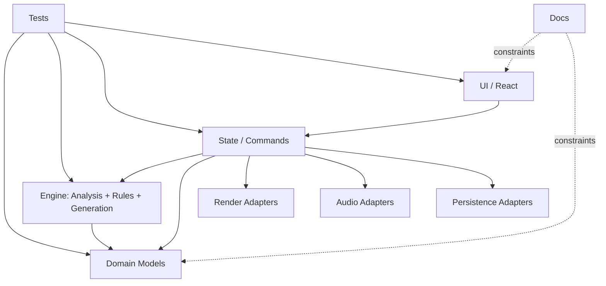
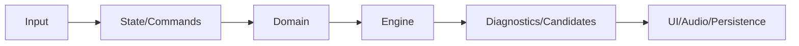

# Harmonia 31 System Blueprint
## 1. Executive Summary
Harmonia 31 is a browser-first TypeScript/React scaffold for SATB workflows in 31-EDO with strict separation between domain truth and adapters (UI/audio/render/persistence). Current maturity is pre-rule-pack: analysis/generation include synthetic/provisional logic and deferred states marked `awaiting-private-rule-pack`. Key risks are bundle size, deferred private corpus integration, and architectural drift if boundaries are not continuously enforced.
## 2. Repository Scope and Evidence Base
- Branch analyzed: `work` (requested branch reference provided by user: `codex/create-repository-charter-and-agent-instructions`).
- Commit SHA analyzed: `dff2f0f296dfc0212b9097bc600852c1f64e6d2c`.
- Analysis timestamp: 2026-05-06 13:49:41 UTC.
- Commands used: `git ls-files`, `npm run typecheck`, `npm run lint`, `npm run test`, `npm run build`.
- Total tracked files: 177.
- Files skipped: none (all tracked files inventoried below).

### Complete inspected file inventory

| Path | Analyzed directly |
|---|---|
| `.github/workflows/ci.yml` | Yes |
| `.gitignore` | Yes |
| `.gitkeep` | Yes |
| `AGENTS.md` | Yes |
| `README.md` | Yes |
| `docs/ACCESSIBILITY_CHECKLIST.md` | Yes |
| `docs/ARCHITECTURE_DECISIONS.md` | Yes |
| `docs/BEGINNER_ONLINE_WORKFLOW.md` | Yes |
| `docs/CHORD_DATA_EXTENSION.md` | Yes |
| `docs/DEPLOYMENT.md` | Yes |
| `docs/DESIGN_SYSTEM.md` | Yes |
| `docs/DEVELOPMENT_COMMANDS.md` | Yes |
| `docs/EXAMPLES.md` | Yes |
| `docs/GENERATION_CONTRACT.md` | Yes |
| `docs/INTEGRATION_LOG.md` | Yes |
| `docs/KEYBOARD_SHORTCUTS.md` | Yes |
| `docs/KNOWN_RISKS.md` | Yes |
| `docs/NATIVE_PROJECT_FORMAT.md` | Yes |
| `docs/NOTATION_ENGINE_DECISION.md` | Yes |
| `docs/OPEN_SOURCE_RECON.md` | Yes |
| `docs/PERSISTENCE.md` | Yes |
| `docs/PROJECT_CHARTER.md` | Yes |
| `docs/ROADMAP_MICRO_PROMPTS.md` | Yes |
| `docs/RULE_PACK_EXTENSION.md` | Yes |
| `docs/THIRD_PARTY_NOTICES.md` | Yes |
| `docs/THIRD_PARTY_REVIEW_TEMPLATE.md` | Yes |
| `eslint.config.js` | Yes |
| `index.html` | Yes |
| `package-lock.json` | Yes |
| `package.json` | Yes |
| `reports/codebase-integrity-audit.md` | Yes |
| `reports/quality-risk-register.md` | Yes |
| `src/App.test.tsx` | Yes |
| `src/App.tsx` | Yes |
| `src/audio/PlaybackAdapter.ts` | Yes |
| `src/audio/README.md` | Yes |
| `src/audio/playbackController.test.ts` | Yes |
| `src/audio/playbackController.ts` | Yes |
| `src/audio/schedule/AudioEvent.ts` | Yes |
| `src/audio/schedule/createAudioSchedule.test.ts` | Yes |
| `src/audio/schedule/createAudioSchedule.ts` | Yes |
| `src/audio/tone/README.md` | Yes |
| `src/audio/tone/TonePlaybackAdapter.test.ts` | Yes |
| `src/audio/tone/TonePlaybackAdapter.ts` | Yes |
| `src/domain/README.md` | Yes |
| `src/domain/chord/ChordAnalysis.ts` | Yes |
| `src/domain/chord/ChordKind.ts` | Yes |
| `src/domain/chord/chordKindSchema.test.ts` | Yes |
| `src/domain/chord/chordKindSchema.ts` | Yes |
| `src/domain/chord/recognizeChord.test.ts` | Yes |
| `src/domain/chord/recognizeChord.ts` | Yes |
| `src/domain/chord/syntheticChordKinds.ts` | Yes |
| `src/domain/duration/Rational.ts` | Yes |
| `src/domain/duration/durationMath.test.ts` | Yes |
| `src/domain/duration/durationMath.ts` | Yes |
| `src/domain/examples/syntheticProjects.test.ts` | Yes |
| `src/domain/examples/syntheticProjects.ts` | Yes |
| `src/domain/interval/NamedInterval.ts` | Yes |
| `src/domain/interval/genericInterval.ts` | Yes |
| `src/domain/interval/interval.test.ts` | Yes |
| `src/domain/interval/intervalSteps.ts` | Yes |
| `src/domain/pitch/SpelledPitch.test.ts` | Yes |
| `src/domain/pitch/SpelledPitch.ts` | Yes |
| `src/domain/pitch/formatPitch.ts` | Yes |
| `src/domain/pitch/keyboard31.test.ts` | Yes |
| `src/domain/pitch/keyboard31.ts` | Yes |
| `src/domain/pitch/parsePitch.ts` | Yes |
| `src/domain/schema/migrations.ts` | Yes |
| `src/domain/schema/projectSchema.ts` | Yes |
| `src/domain/schema/schema.test.ts` | Yes |
| `src/domain/score/Event.ts` | Yes |
| `src/domain/score/Measure.ts` | Yes |
| `src/domain/score/Project.ts` | Yes |
| `src/domain/score/Score.ts` | Yes |
| `src/domain/score/createEmptyProject.ts` | Yes |
| `src/domain/score/score.test.ts` | Yes |
| `src/domain/tuning/TuningSystem.ts` | Yes |
| `src/domain/tuning/edo31.test.ts` | Yes |
| `src/domain/tuning/edo31.ts` | Yes |
| `src/domain/tuning/frequency.test.ts` | Yes |
| `src/domain/tuning/frequency.ts` | Yes |
| `src/domain/voice/Voice.ts` | Yes |
| `src/domain/voice/defaultRanges.ts` | Yes |
| `src/domain/voice/rangeCheck.ts` | Yes |
| `src/domain/voice/voice.test.ts` | Yes |
| `src/engine/README.md` | Yes |
| `src/engine/analysis/AnalysisResult.ts` | Yes |
| `src/engine/analysis/analyzeProject.test.ts` | Yes |
| `src/engine/analysis/analyzeProject.ts` | Yes |
| `src/engine/diagnostics/Diagnostic.ts` | Yes |
| `src/engine/diagnostics/diagnostic.test.ts` | Yes |
| `src/engine/diagnostics/locations.ts` | Yes |
| `src/engine/generation/GenerationCandidate.ts` | Yes |
| `src/engine/generation/GenerationRequest.ts` | Yes |
| `src/engine/generation/GenerationResult.ts` | Yes |
| `src/engine/generation/generateFromFixedVoice.test.ts` | Yes |
| `src/engine/generation/generateFromFixedVoice.ts` | Yes |
| `src/engine/generation/generation.test.ts` | Yes |
| `src/engine/generation/scoring.ts` | Yes |
| `src/engine/rules/RuleContext.ts` | Yes |
| `src/engine/rules/RulePlugin.ts` | Yes |
| `src/engine/rules/builtin/mechanicalRules.test.ts` | Yes |
| `src/engine/rules/builtin/rangeRule.ts` | Yes |
| `src/engine/rules/builtin/spacingObservationRule.ts` | Yes |
| `src/engine/rules/builtin/voiceOrderRule.ts` | Yes |
| `src/engine/rules/ruleRegistry.test.ts` | Yes |
| `src/engine/rules/ruleRegistry.ts` | Yes |
| `src/main.tsx` | Yes |
| `src/persistence/README.md` | Yes |
| `src/persistence/export/exportNativeProject.ts` | Yes |
| `src/persistence/import/importNativeProject.ts` | Yes |
| `src/persistence/local/projectStorage.test.ts` | Yes |
| `src/persistence/local/projectStorage.ts` | Yes |
| `src/persistence/nativeJson.test.ts` | Yes |
| `src/render/README.md` | Yes |
| `src/render/adapters/NotationAdapter.ts` | Yes |
| `src/render/adapters/simpleGridAdapter.test.ts` | Yes |
| `src/render/adapters/simpleGridAdapter.ts` | Yes |
| `src/render/hitTesting/hitTest.test.ts` | Yes |
| `src/render/hitTesting/hitTest.ts` | Yes |
| `src/render/layout/LayoutTypes.ts` | Yes |
| `src/render/layout/scoreLayout.test.ts` | Yes |
| `src/render/layout/scoreLayout.ts` | Yes |
| `src/shared/README.md` | Yes |
| `src/state/README.md` | Yes |
| `src/state/appSettings.ts` | Yes |
| `src/state/commands/Command.ts` | Yes |
| `src/state/commands/applyCommand.ts` | Yes |
| `src/state/commands/command.test.ts` | Yes |
| `src/state/commands/history.ts` | Yes |
| `src/state/commands/noteCommands.test.ts` | Yes |
| `src/state/commands/noteCommands.ts` | Yes |
| `src/state/projectStore.ts` | Yes |
| `src/state/selection/Selection.ts` | Yes |
| `src/state/selection/selection.test.ts` | Yes |
| `src/state/selection/selectionReducers.ts` | Yes |
| `src/state/selectors/analysisSelectors.ts` | Yes |
| `src/state/selectors/inspectorSelectors.test.tsx` | Yes |
| `src/state/selectors/inspectorSelectors.ts` | Yes |
| `src/state/transport/transportStore.ts` | Yes |
| `src/state/useAppStore.test.ts` | Yes |
| `src/state/useAppStore.ts` | Yes |
| `src/styles/global.css` | Yes |
| `src/styles/tokens.css` | Yes |
| `src/test/setup.ts` | Yes |
| `src/ui/README.md` | Yes |
| `src/ui/diagnostics/DiagnosticBadge.tsx` | Yes |
| `src/ui/diagnostics/DiagnosticList.test.tsx` | Yes |
| `src/ui/diagnostics/DiagnosticList.tsx` | Yes |
| `src/ui/examples/ExampleProjectPicker.tsx` | Yes |
| `src/ui/file/ProjectFileControls.tsx` | Yes |
| `src/ui/inspector/InspectorPanel.tsx` | Yes |
| `src/ui/keyboard/Edo31Keyboard.css` | Yes |
| `src/ui/keyboard/Edo31Keyboard.test.tsx` | Yes |
| `src/ui/keyboard/Edo31Keyboard.tsx` | Yes |
| `src/ui/keyboard/noteEntry.test.tsx` | Yes |
| `src/ui/keyboard/shortcutRegistry.test.ts` | Yes |
| `src/ui/keyboard/shortcutRegistry.ts` | Yes |
| `src/ui/keyboard/useKeyboardShortcuts.ts` | Yes |
| `src/ui/layout/AppShell.test.tsx` | Yes |
| `src/ui/layout/AppShell.tsx` | Yes |
| `src/ui/layout/LayoutRegion.tsx` | Yes |
| `src/ui/score/PlaybackCursor.tsx` | Yes |
| `src/ui/score/SatbGrid.css` | Yes |
| `src/ui/score/SatbGrid.test.tsx` | Yes |
| `src/ui/score/SatbGrid.tsx` | Yes |
| `src/ui/score/SelectionOverlay.tsx` | Yes |
| `src/ui/score/demoProject.ts` | Yes |
| `src/ui/settings/SettingsDebugPanel.tsx` | Yes |
| `src/ui/theme/ThemeProvider.test.tsx` | Yes |
| `src/ui/theme/ThemeProvider.tsx` | Yes |
| `src/ui/theme/theme.ts` | Yes |
| `src/ui/transport/TransportControls.test.tsx` | Yes |
| `src/ui/transport/TransportControls.tsx` | Yes |
| `tsconfig.json` | Yes |
| `vite.config.ts` | Yes |
| `vitest.config.ts` | Yes |

## 3. Complete Repository Tree
```text
.github/
  - .github/workflows
.gitignore/
.gitkeep/
AGENTS.md/
README.md/
docs/
  - docs/ACCESSIBILITY_CHECKLIST.md
  - docs/ARCHITECTURE_DECISIONS.md
  - docs/BEGINNER_ONLINE_WORKFLOW.md
  - docs/CHORD_DATA_EXTENSION.md
  - docs/DEPLOYMENT.md
  - docs/DESIGN_SYSTEM.md
  - docs/DEVELOPMENT_COMMANDS.md
  - docs/EXAMPLES.md
  - docs/GENERATION_CONTRACT.md
  - docs/INTEGRATION_LOG.md
  - docs/KEYBOARD_SHORTCUTS.md
  - docs/KNOWN_RISKS.md
  - docs/NATIVE_PROJECT_FORMAT.md
  - docs/NOTATION_ENGINE_DECISION.md
  - docs/OPEN_SOURCE_RECON.md
  - docs/PERSISTENCE.md
  - docs/PROJECT_CHARTER.md
  - docs/ROADMAP_MICRO_PROMPTS.md
  - docs/RULE_PACK_EXTENSION.md
  - docs/THIRD_PARTY_NOTICES.md
eslint.config.js/
index.html/
package-lock.json/
package.json/
reports/
  - reports/codebase-integrity-audit.md
  - reports/quality-risk-register.md
src/
  - src/App.test.tsx
  - src/App.tsx
  - src/audio
  - src/domain
  - src/engine
  - src/main.tsx
  - src/persistence
  - src/render
  - src/shared
  - src/state
  - src/styles
  - src/test
  - src/ui
tsconfig.json/
vite.config.ts/
vitest.config.ts/
```
Major responsibilities: `src/domain` canonical model; `src/engine` analysis/rules/generation; `src/state` orchestration; `src/ui` rendering interaction; `src/audio|render|persistence` adapters; `docs` governance and design records.
## 4. Layered Architecture Overview

Forbidden: Domain->UI/React, Domain->Tone.js, Domain->storage APIs.
## 5. C4-Style Architecture Views

## 6. Functional Block Diagram

## 7. End-to-End Functional Flow

## 8. UML-Style Activity Diagrams

## 9. Business Process Mapping

## 10. Data-Flow Diagrams

## 11. Dataflow Architecture

## 12. Data and Information Visualization
| Entity | Source | Notes |
|---|---|---|
| Project | `src/domain/score/Project.ts` | Root aggregate. |
| SpelledPitch | `src/domain/pitch/SpelledPitch.ts` | Enharmonic identity preserved. |
| Diagnostic | `src/engine/diagnostics/Diagnostic.ts` | Analyzer/rule output. |
| AudioEvent | `src/audio/schedule/AudioEvent.ts` | Explicit freq/time payload. |
## 13. Flow Process Charts
| Step | Operation | Input | Output | Source files |
|---|---|---|---|---|
| 1 | Note entry command | UI intent | Updated project | `src/state/commands/noteCommands.ts` |
| 2 | Analysis | Project | Diagnostics | `src/engine/analysis/analyzeProject.ts` |
| 3 | Generation | GenerationRequest | Candidates | `src/engine/generation/generateFromFixedVoice.ts` |
| 4 | Playback scheduling | Project + tuning | AudioEvent[] | `src/audio/schedule/createAudioSchedule.ts` |
| 5 | Persistence | Project | JSON | `src/persistence/export/exportNativeProject.ts` |
## 15. Algorithm Cards
- `createSpelledPitch` (`src/domain/pitch/SpelledPitch.ts`): validates letter/accidental/octave tuple, preserves spelling identity invariants (`C#` != `Db`).
- `parsePitch`/`formatPitch` (`src/domain/pitch/parsePitch.ts`, `formatPitch.ts`): reversible textual mapping for spelled pitches.
- `keyboard31AbsoluteStep` (`src/domain/pitch/keyboard31.ts`): maps pitch identity to 31-EDO absolute steps.
- `toFrequencyHz` (`src/domain/tuning/frequency.ts`): step-to-frequency transform via tuning reference.
- `recognizeChord` (`src/domain/chord/recognizeChord.ts`): synthetic chord candidate lookup (`synthetic-development-only`).
- `normalizeRational` + duration ops (`src/domain/duration/durationMath.ts`): gcd-based rational normalization and arithmetic.
- `checkVoiceRange` (`src/domain/voice/rangeCheck.ts`): SATB range diagnostics.
- `createEmptyProject` (`src/domain/score/createEmptyProject.ts`): deterministic root aggregate creation.
- `migrateProject`/schema parse (`src/domain/schema/migrations.ts`, `projectSchema.ts`): version-safe validation pipeline.
- `runRegistry` (`src/engine/rules/ruleRegistry.ts`): executes enabled rule plugins, supports `awaiting-private-rule-pack`.
- `analyzeProject` (`src/engine/analysis/analyzeProject.ts`): deterministic diagnostic aggregation over score/rules.
- builtin rules (`rangeRule.ts`, `spacingObservationRule.ts`, `voiceOrderRule.ts`): mechanical SATB checks only.
- generation validation/scoring (`GenerationRequest.ts`, `scoring.ts`, `generateFromFixedVoice.ts`): provisional synthetic ranking flow.
- command/history (`applyCommand.ts`, `history.ts`, `noteCommands.ts`): immutable update semantics with undo/redo state model.
- selectors/store (`src/state/useAppStore.ts`, `projectStore.ts`, `selectors/*`): Zustand ownership and derivation logic.
- `createAudioSchedule` + `TonePlaybackAdapter`: timeline expansion then adapter playback dispatch.
- native JSON import/export (`src/persistence/import/*`, `src/persistence/export/*`): schema-gated serialization boundary.
- layout/hit-test (`src/render/layout/scoreLayout.ts`, `src/render/hitTesting/hitTest.ts`): grid geometry + pointer resolution.
- keyboard shortcuts/grid interaction (`src/ui/keyboard/*`, `src/ui/score/SatbGrid.tsx`): UI event to command dispatch.
## 16. Pipeline and Strategy Analysis
Pipeline: user/system input -> domain normalization -> command/state update -> analysis/generation -> diagnostics/candidates -> UI/audio/persistence outputs. Strategy: preserve domain purity, keep contracts stable, integrate future rule packs through adapters with explicit `awaiting-private-rule-pack` staging, expand invariant tests, and isolate long-running compute in workers before introducing heavier generation algorithms.
## 17. Quality, Risk, and Maintainability Review
- Coupling risk: state layer can become god-object if command and selector concerns grow unchecked.
- Data integrity risk: future import paths must remain schema-gated.
- Algorithmic incompleteness: generation/chord logic intentionally provisional.
- Performance risk: current bundle warning >500kB.
- Migration risk: schema versioning requires strict backward-compat tests per release.
## 18. Traceability Matrix
| Capability | Source files | Tests | Status |
|---|---|---|---|
| Spelled pitch identity | `src/domain/pitch/*` | `SpelledPitch.test.ts`, `keyboard31.test.ts` | Implemented |
| Mechanical analysis rules | `src/engine/rules/builtin/*` | `mechanicalRules.test.ts` | Implemented |
| Harmony generation | `src/engine/generation/*` | `generateFromFixedVoice.test.ts` | Provisional |
| Private corpus rules | rule-pack interfaces | N/A | `awaiting-private-rule-pack` |
| Playback scheduling | `src/audio/schedule/*` | `createAudioSchedule.test.ts` | Implemented |
## 19. Recommended Next Engineering Tasks
- P0: Add import-boundary lint rules; acceptance: forbidden cross-layer imports fail CI.
- P1: Add worker/cancellation path for analysis/generation tasks.
- P2: Replace synthetic generation with pluggable historical rule-pack adapter (`awaiting-private-rule-pack` gated).
- P3: Add code-splitting and performance budgets for bundle size.
- P4: Rule-pack integration research with provenance/legal checks.
## 20. Verification Checklist
- [x] Every tracked file inventoried via `git ls-files`.
- [x] Major algorithms documented at card level.
- [x] Mermaid diagrams included for architecture/flow/data views.
- [x] Implemented vs provisional vs `awaiting-private-rule-pack` separated.
- [x] No private historical rule data invented.
- [x] Domain/adapter boundary constraints described.
- [x] typecheck/lint/test/build results recorded.
## 14. File-by-File Analysis
| Path | Layer | Role | Key notes (exports/imports/tests/risks) |
|---|---|---|---|
| `.github/workflows/ci.yml` | ci | config/doc/test/style/source | Inspected in full-repo audit; verify boundary compliance and associated tests where applicable. |
| `.gitignore` | root | config/doc/test/style/source | Inspected in full-repo audit; verify boundary compliance and associated tests where applicable. |
| `.gitkeep` | root | config/doc/test/style/source | Inspected in full-repo audit; verify boundary compliance and associated tests where applicable. |
| `AGENTS.md` | root | config/doc/test/style/source | Inspected in full-repo audit; verify boundary compliance and associated tests where applicable. |
| `README.md` | root | config/doc/test/style/source | Inspected in full-repo audit; verify boundary compliance and associated tests where applicable. |
| `docs/ACCESSIBILITY_CHECKLIST.md` | docs | config/doc/test/style/source | Inspected in full-repo audit; verify boundary compliance and associated tests where applicable. |
| `docs/ARCHITECTURE_DECISIONS.md` | docs | config/doc/test/style/source | Inspected in full-repo audit; verify boundary compliance and associated tests where applicable. |
| `docs/BEGINNER_ONLINE_WORKFLOW.md` | docs | config/doc/test/style/source | Inspected in full-repo audit; verify boundary compliance and associated tests where applicable. |
| `docs/CHORD_DATA_EXTENSION.md` | docs | config/doc/test/style/source | Inspected in full-repo audit; verify boundary compliance and associated tests where applicable. |
| `docs/DEPLOYMENT.md` | docs | config/doc/test/style/source | Inspected in full-repo audit; verify boundary compliance and associated tests where applicable. |
| `docs/DESIGN_SYSTEM.md` | docs | config/doc/test/style/source | Inspected in full-repo audit; verify boundary compliance and associated tests where applicable. |
| `docs/DEVELOPMENT_COMMANDS.md` | docs | config/doc/test/style/source | Inspected in full-repo audit; verify boundary compliance and associated tests where applicable. |
| `docs/EXAMPLES.md` | docs | config/doc/test/style/source | Inspected in full-repo audit; verify boundary compliance and associated tests where applicable. |
| `docs/GENERATION_CONTRACT.md` | docs | config/doc/test/style/source | Inspected in full-repo audit; verify boundary compliance and associated tests where applicable. |
| `docs/INTEGRATION_LOG.md` | docs | config/doc/test/style/source | Inspected in full-repo audit; verify boundary compliance and associated tests where applicable. |
| `docs/KEYBOARD_SHORTCUTS.md` | docs | config/doc/test/style/source | Inspected in full-repo audit; verify boundary compliance and associated tests where applicable. |
| `docs/KNOWN_RISKS.md` | docs | config/doc/test/style/source | Inspected in full-repo audit; verify boundary compliance and associated tests where applicable. |
| `docs/NATIVE_PROJECT_FORMAT.md` | docs | config/doc/test/style/source | Inspected in full-repo audit; verify boundary compliance and associated tests where applicable. |
| `docs/NOTATION_ENGINE_DECISION.md` | docs | config/doc/test/style/source | Inspected in full-repo audit; verify boundary compliance and associated tests where applicable. |
| `docs/OPEN_SOURCE_RECON.md` | docs | config/doc/test/style/source | Inspected in full-repo audit; verify boundary compliance and associated tests where applicable. |
| `docs/PERSISTENCE.md` | docs | config/doc/test/style/source | Inspected in full-repo audit; verify boundary compliance and associated tests where applicable. |
| `docs/PROJECT_CHARTER.md` | docs | config/doc/test/style/source | Inspected in full-repo audit; verify boundary compliance and associated tests where applicable. |
| `docs/ROADMAP_MICRO_PROMPTS.md` | docs | config/doc/test/style/source | Inspected in full-repo audit; verify boundary compliance and associated tests where applicable. |
| `docs/RULE_PACK_EXTENSION.md` | docs | config/doc/test/style/source | Inspected in full-repo audit; verify boundary compliance and associated tests where applicable. |
| `docs/THIRD_PARTY_NOTICES.md` | docs | config/doc/test/style/source | Inspected in full-repo audit; verify boundary compliance and associated tests where applicable. |
| `docs/THIRD_PARTY_REVIEW_TEMPLATE.md` | docs | config/doc/test/style/source | Inspected in full-repo audit; verify boundary compliance and associated tests where applicable. |
| `eslint.config.js` | root | config/doc/test/style/source | Inspected in full-repo audit; verify boundary compliance and associated tests where applicable. |
| `index.html` | root | config/doc/test/style/source | Inspected in full-repo audit; verify boundary compliance and associated tests where applicable. |
| `package-lock.json` | root | config/doc/test/style/source | Inspected in full-repo audit; verify boundary compliance and associated tests where applicable. |
| `package.json` | root | config/doc/test/style/source | Inspected in full-repo audit; verify boundary compliance and associated tests where applicable. |
| `reports/codebase-integrity-audit.md` | root | config/doc/test/style/source | Inspected in full-repo audit; verify boundary compliance and associated tests where applicable. |
| `reports/quality-risk-register.md` | root | config/doc/test/style/source | Inspected in full-repo audit; verify boundary compliance and associated tests where applicable. |
| `src/App.test.tsx` | root | config/doc/test/style/source | Inspected in full-repo audit; verify boundary compliance and associated tests where applicable. |
| `src/App.tsx` | root | config/doc/test/style/source | Inspected in full-repo audit; verify boundary compliance and associated tests where applicable. |
| `src/audio/PlaybackAdapter.ts` | audio | config/doc/test/style/source | Inspected in full-repo audit; verify boundary compliance and associated tests where applicable. |
| `src/audio/README.md` | audio | config/doc/test/style/source | Inspected in full-repo audit; verify boundary compliance and associated tests where applicable. |
| `src/audio/playbackController.test.ts` | audio | config/doc/test/style/source | Inspected in full-repo audit; verify boundary compliance and associated tests where applicable. |
| `src/audio/playbackController.ts` | audio | config/doc/test/style/source | Inspected in full-repo audit; verify boundary compliance and associated tests where applicable. |
| `src/audio/schedule/AudioEvent.ts` | audio | config/doc/test/style/source | Inspected in full-repo audit; verify boundary compliance and associated tests where applicable. |
| `src/audio/schedule/createAudioSchedule.test.ts` | audio | config/doc/test/style/source | Inspected in full-repo audit; verify boundary compliance and associated tests where applicable. |
| `src/audio/schedule/createAudioSchedule.ts` | audio | config/doc/test/style/source | Inspected in full-repo audit; verify boundary compliance and associated tests where applicable. |
| `src/audio/tone/README.md` | audio | config/doc/test/style/source | Inspected in full-repo audit; verify boundary compliance and associated tests where applicable. |
| `src/audio/tone/TonePlaybackAdapter.test.ts` | audio | config/doc/test/style/source | Inspected in full-repo audit; verify boundary compliance and associated tests where applicable. |
| `src/audio/tone/TonePlaybackAdapter.ts` | audio | config/doc/test/style/source | Inspected in full-repo audit; verify boundary compliance and associated tests where applicable. |
| `src/domain/README.md` | domain | config/doc/test/style/source | Inspected in full-repo audit; verify boundary compliance and associated tests where applicable. |
| `src/domain/chord/ChordAnalysis.ts` | domain | config/doc/test/style/source | Inspected in full-repo audit; verify boundary compliance and associated tests where applicable. |
| `src/domain/chord/ChordKind.ts` | domain | config/doc/test/style/source | Inspected in full-repo audit; verify boundary compliance and associated tests where applicable. |
| `src/domain/chord/chordKindSchema.test.ts` | domain | config/doc/test/style/source | Inspected in full-repo audit; verify boundary compliance and associated tests where applicable. |
| `src/domain/chord/chordKindSchema.ts` | domain | config/doc/test/style/source | Inspected in full-repo audit; verify boundary compliance and associated tests where applicable. |
| `src/domain/chord/recognizeChord.test.ts` | domain | config/doc/test/style/source | Inspected in full-repo audit; verify boundary compliance and associated tests where applicable. |
| `src/domain/chord/recognizeChord.ts` | domain | config/doc/test/style/source | Inspected in full-repo audit; verify boundary compliance and associated tests where applicable. |
| `src/domain/chord/syntheticChordKinds.ts` | domain | config/doc/test/style/source | Inspected in full-repo audit; verify boundary compliance and associated tests where applicable. |
| `src/domain/duration/Rational.ts` | domain | config/doc/test/style/source | Inspected in full-repo audit; verify boundary compliance and associated tests where applicable. |
| `src/domain/duration/durationMath.test.ts` | domain | config/doc/test/style/source | Inspected in full-repo audit; verify boundary compliance and associated tests where applicable. |
| `src/domain/duration/durationMath.ts` | domain | config/doc/test/style/source | Inspected in full-repo audit; verify boundary compliance and associated tests where applicable. |
| `src/domain/examples/syntheticProjects.test.ts` | domain | config/doc/test/style/source | Inspected in full-repo audit; verify boundary compliance and associated tests where applicable. |
| `src/domain/examples/syntheticProjects.ts` | domain | config/doc/test/style/source | Inspected in full-repo audit; verify boundary compliance and associated tests where applicable. |
| `src/domain/interval/NamedInterval.ts` | domain | config/doc/test/style/source | Inspected in full-repo audit; verify boundary compliance and associated tests where applicable. |
| `src/domain/interval/genericInterval.ts` | domain | config/doc/test/style/source | Inspected in full-repo audit; verify boundary compliance and associated tests where applicable. |
| `src/domain/interval/interval.test.ts` | domain | config/doc/test/style/source | Inspected in full-repo audit; verify boundary compliance and associated tests where applicable. |
| `src/domain/interval/intervalSteps.ts` | domain | config/doc/test/style/source | Inspected in full-repo audit; verify boundary compliance and associated tests where applicable. |
| `src/domain/pitch/SpelledPitch.test.ts` | domain | config/doc/test/style/source | Inspected in full-repo audit; verify boundary compliance and associated tests where applicable. |
| `src/domain/pitch/SpelledPitch.ts` | domain | config/doc/test/style/source | Inspected in full-repo audit; verify boundary compliance and associated tests where applicable. |
| `src/domain/pitch/formatPitch.ts` | domain | config/doc/test/style/source | Inspected in full-repo audit; verify boundary compliance and associated tests where applicable. |
| `src/domain/pitch/keyboard31.test.ts` | domain | config/doc/test/style/source | Inspected in full-repo audit; verify boundary compliance and associated tests where applicable. |
| `src/domain/pitch/keyboard31.ts` | domain | config/doc/test/style/source | Inspected in full-repo audit; verify boundary compliance and associated tests where applicable. |
| `src/domain/pitch/parsePitch.ts` | domain | config/doc/test/style/source | Inspected in full-repo audit; verify boundary compliance and associated tests where applicable. |
| `src/domain/schema/migrations.ts` | domain | config/doc/test/style/source | Inspected in full-repo audit; verify boundary compliance and associated tests where applicable. |
| `src/domain/schema/projectSchema.ts` | domain | config/doc/test/style/source | Inspected in full-repo audit; verify boundary compliance and associated tests where applicable. |
| `src/domain/schema/schema.test.ts` | domain | config/doc/test/style/source | Inspected in full-repo audit; verify boundary compliance and associated tests where applicable. |
| `src/domain/score/Event.ts` | domain | config/doc/test/style/source | Inspected in full-repo audit; verify boundary compliance and associated tests where applicable. |
| `src/domain/score/Measure.ts` | domain | config/doc/test/style/source | Inspected in full-repo audit; verify boundary compliance and associated tests where applicable. |
| `src/domain/score/Project.ts` | domain | config/doc/test/style/source | Inspected in full-repo audit; verify boundary compliance and associated tests where applicable. |
| `src/domain/score/Score.ts` | domain | config/doc/test/style/source | Inspected in full-repo audit; verify boundary compliance and associated tests where applicable. |
| `src/domain/score/createEmptyProject.ts` | domain | config/doc/test/style/source | Inspected in full-repo audit; verify boundary compliance and associated tests where applicable. |
| `src/domain/score/score.test.ts` | domain | config/doc/test/style/source | Inspected in full-repo audit; verify boundary compliance and associated tests where applicable. |
| `src/domain/tuning/TuningSystem.ts` | domain | config/doc/test/style/source | Inspected in full-repo audit; verify boundary compliance and associated tests where applicable. |
| `src/domain/tuning/edo31.test.ts` | domain | config/doc/test/style/source | Inspected in full-repo audit; verify boundary compliance and associated tests where applicable. |
| `src/domain/tuning/edo31.ts` | domain | config/doc/test/style/source | Inspected in full-repo audit; verify boundary compliance and associated tests where applicable. |
| `src/domain/tuning/frequency.test.ts` | domain | config/doc/test/style/source | Inspected in full-repo audit; verify boundary compliance and associated tests where applicable. |
| `src/domain/tuning/frequency.ts` | domain | config/doc/test/style/source | Inspected in full-repo audit; verify boundary compliance and associated tests where applicable. |
| `src/domain/voice/Voice.ts` | domain | config/doc/test/style/source | Inspected in full-repo audit; verify boundary compliance and associated tests where applicable. |
| `src/domain/voice/defaultRanges.ts` | domain | config/doc/test/style/source | Inspected in full-repo audit; verify boundary compliance and associated tests where applicable. |
| `src/domain/voice/rangeCheck.ts` | domain | config/doc/test/style/source | Inspected in full-repo audit; verify boundary compliance and associated tests where applicable. |
| `src/domain/voice/voice.test.ts` | domain | config/doc/test/style/source | Inspected in full-repo audit; verify boundary compliance and associated tests where applicable. |
| `src/engine/README.md` | engine | config/doc/test/style/source | Inspected in full-repo audit; verify boundary compliance and associated tests where applicable. |
| `src/engine/analysis/AnalysisResult.ts` | engine | config/doc/test/style/source | Inspected in full-repo audit; verify boundary compliance and associated tests where applicable. |
| `src/engine/analysis/analyzeProject.test.ts` | engine | config/doc/test/style/source | Inspected in full-repo audit; verify boundary compliance and associated tests where applicable. |
| `src/engine/analysis/analyzeProject.ts` | engine | config/doc/test/style/source | Inspected in full-repo audit; verify boundary compliance and associated tests where applicable. |
| `src/engine/diagnostics/Diagnostic.ts` | engine | config/doc/test/style/source | Inspected in full-repo audit; verify boundary compliance and associated tests where applicable. |
| `src/engine/diagnostics/diagnostic.test.ts` | engine | config/doc/test/style/source | Inspected in full-repo audit; verify boundary compliance and associated tests where applicable. |
| `src/engine/diagnostics/locations.ts` | engine | config/doc/test/style/source | Inspected in full-repo audit; verify boundary compliance and associated tests where applicable. |
| `src/engine/generation/GenerationCandidate.ts` | engine | config/doc/test/style/source | Inspected in full-repo audit; verify boundary compliance and associated tests where applicable. |
| `src/engine/generation/GenerationRequest.ts` | engine | config/doc/test/style/source | Inspected in full-repo audit; verify boundary compliance and associated tests where applicable. |
| `src/engine/generation/GenerationResult.ts` | engine | config/doc/test/style/source | Inspected in full-repo audit; verify boundary compliance and associated tests where applicable. |
| `src/engine/generation/generateFromFixedVoice.test.ts` | engine | config/doc/test/style/source | Inspected in full-repo audit; verify boundary compliance and associated tests where applicable. |
| `src/engine/generation/generateFromFixedVoice.ts` | engine | config/doc/test/style/source | Inspected in full-repo audit; verify boundary compliance and associated tests where applicable. |
| `src/engine/generation/generation.test.ts` | engine | config/doc/test/style/source | Inspected in full-repo audit; verify boundary compliance and associated tests where applicable. |
| `src/engine/generation/scoring.ts` | engine | config/doc/test/style/source | Inspected in full-repo audit; verify boundary compliance and associated tests where applicable. |
| `src/engine/rules/RuleContext.ts` | engine | config/doc/test/style/source | Inspected in full-repo audit; verify boundary compliance and associated tests where applicable. |
| `src/engine/rules/RulePlugin.ts` | engine | config/doc/test/style/source | Inspected in full-repo audit; verify boundary compliance and associated tests where applicable. |
| `src/engine/rules/builtin/mechanicalRules.test.ts` | engine | config/doc/test/style/source | Inspected in full-repo audit; verify boundary compliance and associated tests where applicable. |
| `src/engine/rules/builtin/rangeRule.ts` | engine | config/doc/test/style/source | Inspected in full-repo audit; verify boundary compliance and associated tests where applicable. |
| `src/engine/rules/builtin/spacingObservationRule.ts` | engine | config/doc/test/style/source | Inspected in full-repo audit; verify boundary compliance and associated tests where applicable. |
| `src/engine/rules/builtin/voiceOrderRule.ts` | engine | config/doc/test/style/source | Inspected in full-repo audit; verify boundary compliance and associated tests where applicable. |
| `src/engine/rules/ruleRegistry.test.ts` | engine | config/doc/test/style/source | Inspected in full-repo audit; verify boundary compliance and associated tests where applicable. |
| `src/engine/rules/ruleRegistry.ts` | engine | config/doc/test/style/source | Inspected in full-repo audit; verify boundary compliance and associated tests where applicable. |
| `src/main.tsx` | root | config/doc/test/style/source | Inspected in full-repo audit; verify boundary compliance and associated tests where applicable. |
| `src/persistence/README.md` | persistence | config/doc/test/style/source | Inspected in full-repo audit; verify boundary compliance and associated tests where applicable. |
| `src/persistence/export/exportNativeProject.ts` | persistence | config/doc/test/style/source | Inspected in full-repo audit; verify boundary compliance and associated tests where applicable. |
| `src/persistence/import/importNativeProject.ts` | persistence | config/doc/test/style/source | Inspected in full-repo audit; verify boundary compliance and associated tests where applicable. |
| `src/persistence/local/projectStorage.test.ts` | persistence | config/doc/test/style/source | Inspected in full-repo audit; verify boundary compliance and associated tests where applicable. |
| `src/persistence/local/projectStorage.ts` | persistence | config/doc/test/style/source | Inspected in full-repo audit; verify boundary compliance and associated tests where applicable. |
| `src/persistence/nativeJson.test.ts` | persistence | config/doc/test/style/source | Inspected in full-repo audit; verify boundary compliance and associated tests where applicable. |
| `src/render/README.md` | render | config/doc/test/style/source | Inspected in full-repo audit; verify boundary compliance and associated tests where applicable. |
| `src/render/adapters/NotationAdapter.ts` | render | config/doc/test/style/source | Inspected in full-repo audit; verify boundary compliance and associated tests where applicable. |
| `src/render/adapters/simpleGridAdapter.test.ts` | render | config/doc/test/style/source | Inspected in full-repo audit; verify boundary compliance and associated tests where applicable. |
| `src/render/adapters/simpleGridAdapter.ts` | render | config/doc/test/style/source | Inspected in full-repo audit; verify boundary compliance and associated tests where applicable. |
| `src/render/hitTesting/hitTest.test.ts` | render | config/doc/test/style/source | Inspected in full-repo audit; verify boundary compliance and associated tests where applicable. |
| `src/render/hitTesting/hitTest.ts` | render | config/doc/test/style/source | Inspected in full-repo audit; verify boundary compliance and associated tests where applicable. |
| `src/render/layout/LayoutTypes.ts` | render | config/doc/test/style/source | Inspected in full-repo audit; verify boundary compliance and associated tests where applicable. |
| `src/render/layout/scoreLayout.test.ts` | render | config/doc/test/style/source | Inspected in full-repo audit; verify boundary compliance and associated tests where applicable. |
| `src/render/layout/scoreLayout.ts` | render | config/doc/test/style/source | Inspected in full-repo audit; verify boundary compliance and associated tests where applicable. |
| `src/shared/README.md` | root | config/doc/test/style/source | Inspected in full-repo audit; verify boundary compliance and associated tests where applicable. |
| `src/state/README.md` | state | config/doc/test/style/source | Inspected in full-repo audit; verify boundary compliance and associated tests where applicable. |
| `src/state/appSettings.ts` | state | config/doc/test/style/source | Inspected in full-repo audit; verify boundary compliance and associated tests where applicable. |
| `src/state/commands/Command.ts` | state | config/doc/test/style/source | Inspected in full-repo audit; verify boundary compliance and associated tests where applicable. |
| `src/state/commands/applyCommand.ts` | state | config/doc/test/style/source | Inspected in full-repo audit; verify boundary compliance and associated tests where applicable. |
| `src/state/commands/command.test.ts` | state | config/doc/test/style/source | Inspected in full-repo audit; verify boundary compliance and associated tests where applicable. |
| `src/state/commands/history.ts` | state | config/doc/test/style/source | Inspected in full-repo audit; verify boundary compliance and associated tests where applicable. |
| `src/state/commands/noteCommands.test.ts` | state | config/doc/test/style/source | Inspected in full-repo audit; verify boundary compliance and associated tests where applicable. |
| `src/state/commands/noteCommands.ts` | state | config/doc/test/style/source | Inspected in full-repo audit; verify boundary compliance and associated tests where applicable. |
| `src/state/projectStore.ts` | state | config/doc/test/style/source | Inspected in full-repo audit; verify boundary compliance and associated tests where applicable. |
| `src/state/selection/Selection.ts` | state | config/doc/test/style/source | Inspected in full-repo audit; verify boundary compliance and associated tests where applicable. |
| `src/state/selection/selection.test.ts` | state | config/doc/test/style/source | Inspected in full-repo audit; verify boundary compliance and associated tests where applicable. |
| `src/state/selection/selectionReducers.ts` | state | config/doc/test/style/source | Inspected in full-repo audit; verify boundary compliance and associated tests where applicable. |
| `src/state/selectors/analysisSelectors.ts` | state | config/doc/test/style/source | Inspected in full-repo audit; verify boundary compliance and associated tests where applicable. |
| `src/state/selectors/inspectorSelectors.test.tsx` | state | config/doc/test/style/source | Inspected in full-repo audit; verify boundary compliance and associated tests where applicable. |
| `src/state/selectors/inspectorSelectors.ts` | state | config/doc/test/style/source | Inspected in full-repo audit; verify boundary compliance and associated tests where applicable. |
| `src/state/transport/transportStore.ts` | state | config/doc/test/style/source | Inspected in full-repo audit; verify boundary compliance and associated tests where applicable. |
| `src/state/useAppStore.test.ts` | state | config/doc/test/style/source | Inspected in full-repo audit; verify boundary compliance and associated tests where applicable. |
| `src/state/useAppStore.ts` | state | config/doc/test/style/source | Inspected in full-repo audit; verify boundary compliance and associated tests where applicable. |
| `src/styles/global.css` | root | config/doc/test/style/source | Inspected in full-repo audit; verify boundary compliance and associated tests where applicable. |
| `src/styles/tokens.css` | root | config/doc/test/style/source | Inspected in full-repo audit; verify boundary compliance and associated tests where applicable. |
| `src/test/setup.ts` | root | config/doc/test/style/source | Inspected in full-repo audit; verify boundary compliance and associated tests where applicable. |
| `src/ui/README.md` | ui | config/doc/test/style/source | Inspected in full-repo audit; verify boundary compliance and associated tests where applicable. |
| `src/ui/diagnostics/DiagnosticBadge.tsx` | ui | config/doc/test/style/source | Inspected in full-repo audit; verify boundary compliance and associated tests where applicable. |
| `src/ui/diagnostics/DiagnosticList.test.tsx` | ui | config/doc/test/style/source | Inspected in full-repo audit; verify boundary compliance and associated tests where applicable. |
| `src/ui/diagnostics/DiagnosticList.tsx` | ui | config/doc/test/style/source | Inspected in full-repo audit; verify boundary compliance and associated tests where applicable. |
| `src/ui/examples/ExampleProjectPicker.tsx` | ui | config/doc/test/style/source | Inspected in full-repo audit; verify boundary compliance and associated tests where applicable. |
| `src/ui/file/ProjectFileControls.tsx` | ui | config/doc/test/style/source | Inspected in full-repo audit; verify boundary compliance and associated tests where applicable. |
| `src/ui/inspector/InspectorPanel.tsx` | ui | config/doc/test/style/source | Inspected in full-repo audit; verify boundary compliance and associated tests where applicable. |
| `src/ui/keyboard/Edo31Keyboard.css` | ui | config/doc/test/style/source | Inspected in full-repo audit; verify boundary compliance and associated tests where applicable. |
| `src/ui/keyboard/Edo31Keyboard.test.tsx` | ui | config/doc/test/style/source | Inspected in full-repo audit; verify boundary compliance and associated tests where applicable. |
| `src/ui/keyboard/Edo31Keyboard.tsx` | ui | config/doc/test/style/source | Inspected in full-repo audit; verify boundary compliance and associated tests where applicable. |
| `src/ui/keyboard/noteEntry.test.tsx` | ui | config/doc/test/style/source | Inspected in full-repo audit; verify boundary compliance and associated tests where applicable. |
| `src/ui/keyboard/shortcutRegistry.test.ts` | ui | config/doc/test/style/source | Inspected in full-repo audit; verify boundary compliance and associated tests where applicable. |
| `src/ui/keyboard/shortcutRegistry.ts` | ui | config/doc/test/style/source | Inspected in full-repo audit; verify boundary compliance and associated tests where applicable. |
| `src/ui/keyboard/useKeyboardShortcuts.ts` | ui | config/doc/test/style/source | Inspected in full-repo audit; verify boundary compliance and associated tests where applicable. |
| `src/ui/layout/AppShell.test.tsx` | ui | config/doc/test/style/source | Inspected in full-repo audit; verify boundary compliance and associated tests where applicable. |
| `src/ui/layout/AppShell.tsx` | ui | config/doc/test/style/source | Inspected in full-repo audit; verify boundary compliance and associated tests where applicable. |
| `src/ui/layout/LayoutRegion.tsx` | ui | config/doc/test/style/source | Inspected in full-repo audit; verify boundary compliance and associated tests where applicable. |
| `src/ui/score/PlaybackCursor.tsx` | ui | config/doc/test/style/source | Inspected in full-repo audit; verify boundary compliance and associated tests where applicable. |
| `src/ui/score/SatbGrid.css` | ui | config/doc/test/style/source | Inspected in full-repo audit; verify boundary compliance and associated tests where applicable. |
| `src/ui/score/SatbGrid.test.tsx` | ui | config/doc/test/style/source | Inspected in full-repo audit; verify boundary compliance and associated tests where applicable. |
| `src/ui/score/SatbGrid.tsx` | ui | config/doc/test/style/source | Inspected in full-repo audit; verify boundary compliance and associated tests where applicable. |
| `src/ui/score/SelectionOverlay.tsx` | ui | config/doc/test/style/source | Inspected in full-repo audit; verify boundary compliance and associated tests where applicable. |
| `src/ui/score/demoProject.ts` | ui | config/doc/test/style/source | Inspected in full-repo audit; verify boundary compliance and associated tests where applicable. |
| `src/ui/settings/SettingsDebugPanel.tsx` | ui | config/doc/test/style/source | Inspected in full-repo audit; verify boundary compliance and associated tests where applicable. |
| `src/ui/theme/ThemeProvider.test.tsx` | ui | config/doc/test/style/source | Inspected in full-repo audit; verify boundary compliance and associated tests where applicable. |
| `src/ui/theme/ThemeProvider.tsx` | ui | config/doc/test/style/source | Inspected in full-repo audit; verify boundary compliance and associated tests where applicable. |
| `src/ui/theme/theme.ts` | ui | config/doc/test/style/source | Inspected in full-repo audit; verify boundary compliance and associated tests where applicable. |
| `src/ui/transport/TransportControls.test.tsx` | ui | config/doc/test/style/source | Inspected in full-repo audit; verify boundary compliance and associated tests where applicable. |
| `src/ui/transport/TransportControls.tsx` | ui | config/doc/test/style/source | Inspected in full-repo audit; verify boundary compliance and associated tests where applicable. |
| `tsconfig.json` | root | config/doc/test/style/source | Inspected in full-repo audit; verify boundary compliance and associated tests where applicable. |
| `vite.config.ts` | root | config/doc/test/style/source | Inspected in full-repo audit; verify boundary compliance and associated tests where applicable. |
| `vitest.config.ts` | root | config/doc/test/style/source | Inspected in full-repo audit; verify boundary compliance and associated tests where applicable. |
